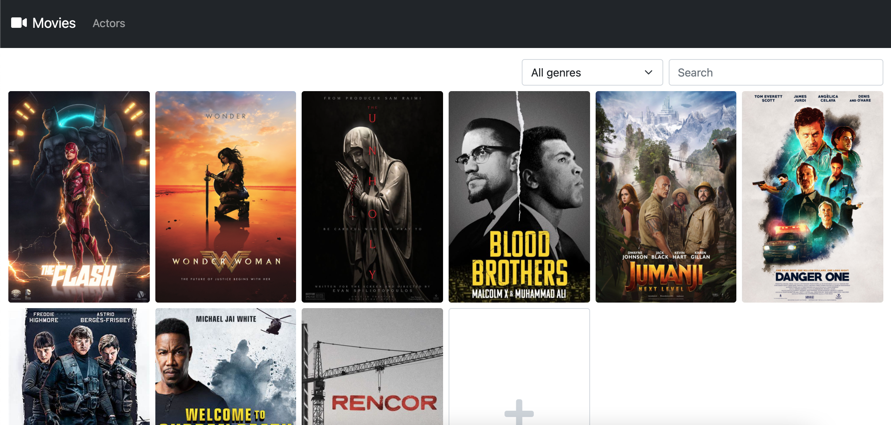
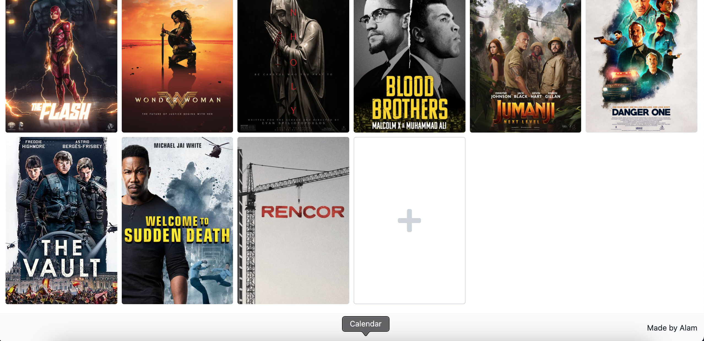
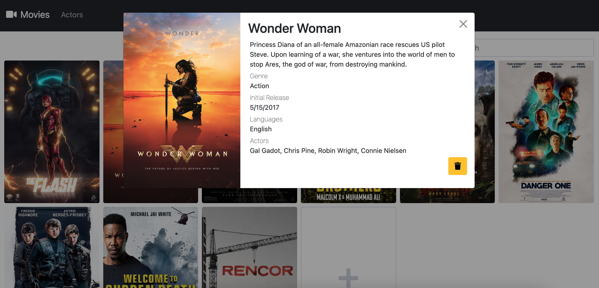
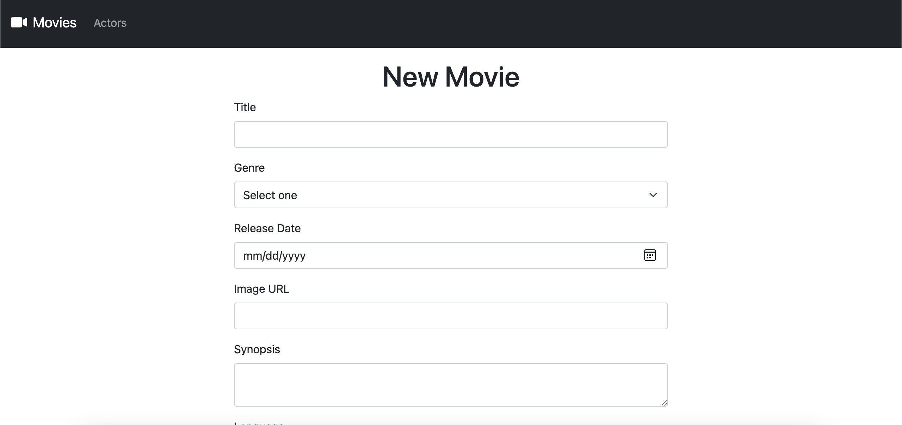
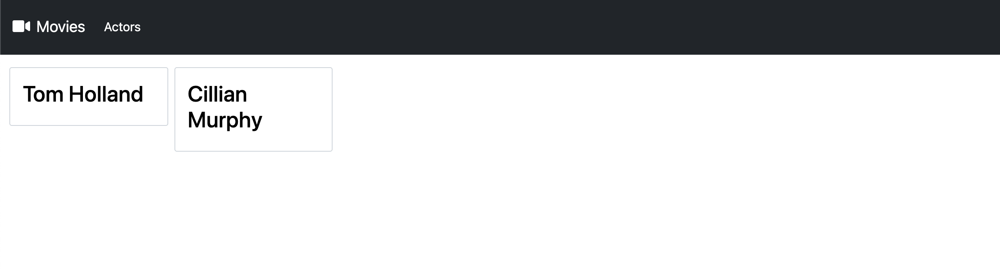
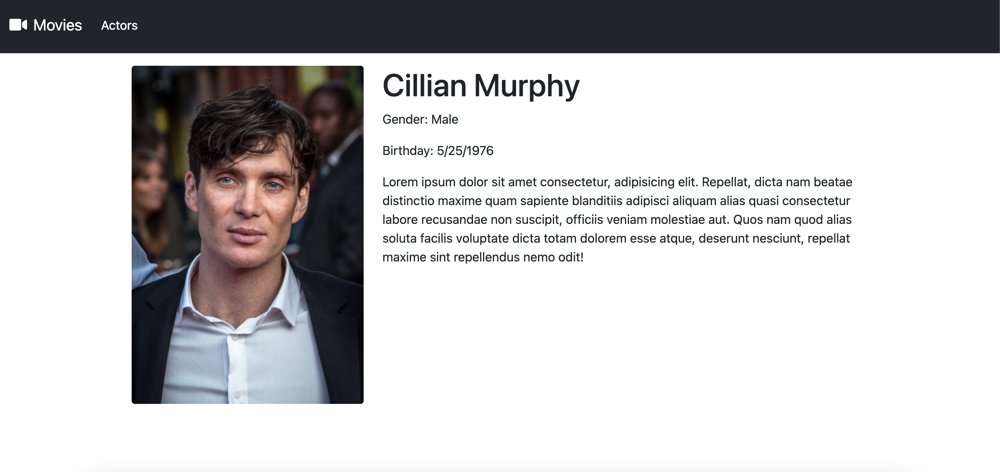

# Movies Manager

> This is a movie manager app in which you can do three of the four basic operations: create, delete and read movies from a database.

## Table of Contents

- [Technologies Used](#technologies-used)
- [Features](#features)
- [Screenshots](#screenshots)
- [Installation](#setup)

## Technologies Used

- React - version 17.0.2
- Express - version 4.17.1
- Postgresql - version 9.5

## Features

- List movies
- Add movies
- Delete movies
- Show movie details
- Filter movies by genre
- Search movies by title and actors
- List actors

## Screenshots

**Movies**









**Actors**





## Installation

**Client**

```
cd client
npm install
```

**Server**

```
cd server
npm install
```

**Database**

In db folder you can find the scripts. Open with your db manager or copy and paste it.
