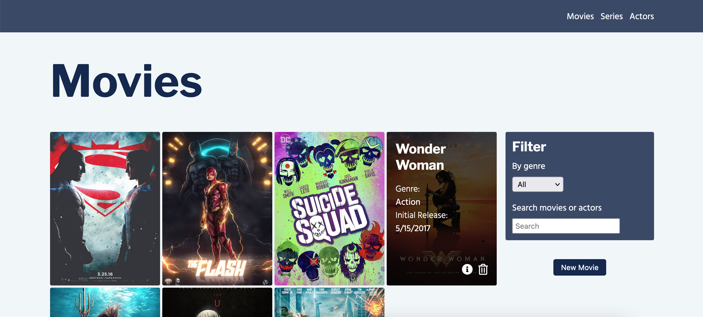
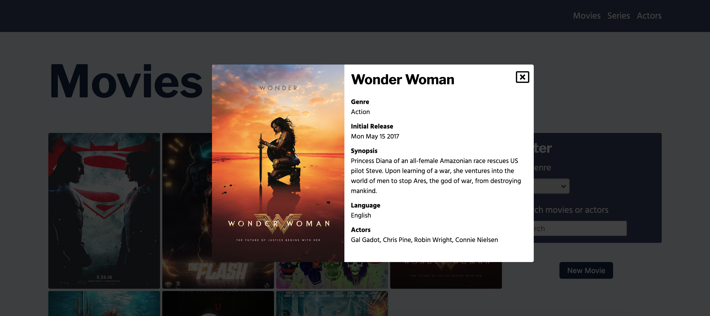

# Movies Manager

> This is a movie manager in which you can do three of the four basic operations (CRUD): create, delete and read movies.

## Table of Contents

- [Technologies Used](#technologies-used)
- [Features](#features)
- [Screenshots](#screenshots)
- [Setup](#setup)
- [Project Status](#project-status)
- [Contact](#contact)

## Technologies Used

- React - version 17.0.2
- Node - version 16.6.1
- Express - version 4.17.1
- Postgrsql - version 9.5

## Features

- List movies
- Add movies
- Delete movies
- Show movie details
- Filter movies by genre
- Search movies by title and actors

## Screenshots





## Setup

**Client**

```
npm install
```

then

```
npm start
```

**Server**

```
npm install
```

then

```
npm run server
```

**Database**

In db folder you can find the scripts. Open with your db manager or copy and paste it.

## Project Status

Project is: _complete_. This is just a test project.

## Contact

Created by [@alamsierrad](https://www.instagram.com/alamsierrad/?hl=en) - feel free to contact me!
