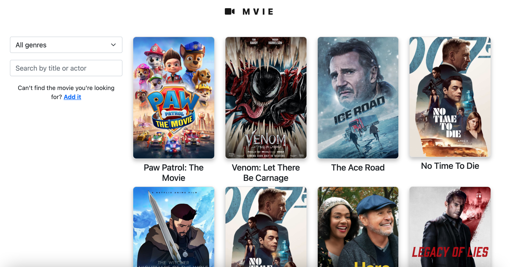
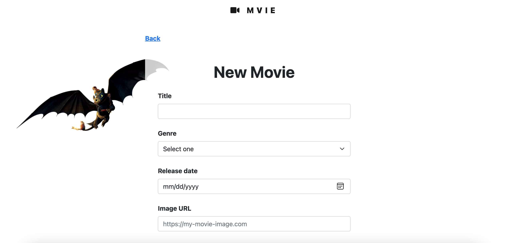
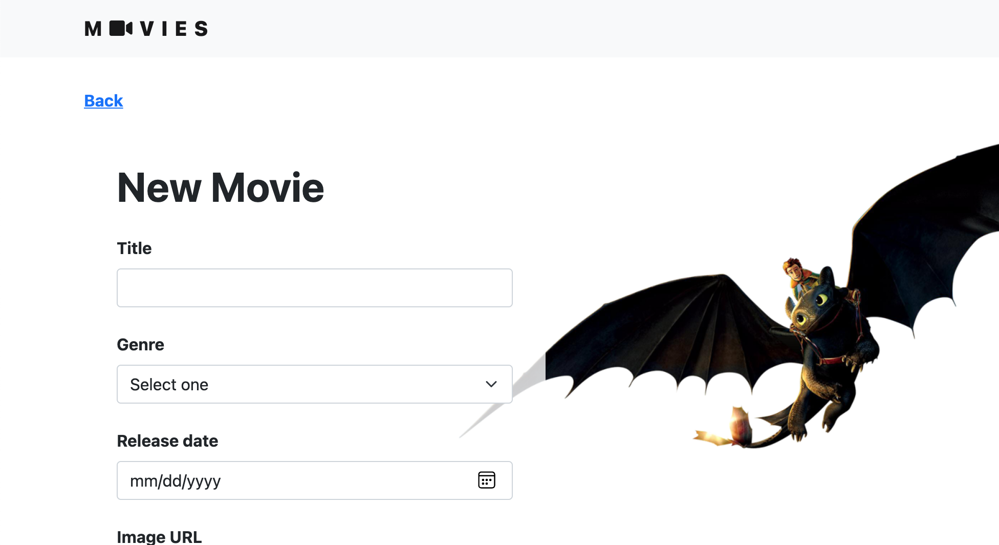

# Movies Manager

## Table of Contents

- [Technologies Used](#technologies-used)
- [Features](#features)
- [Screenshots](#screenshots)
- [Installation](#setup)

## Technologies Used

- React - version 17.0.2
- Firebase 9

## Features

- List movies
- Add movies
- Show movie details
- Filter movies by genre
- Search movies by title and actors

## Screenshots








## Setup

**Client**

```
cd client
npm install
npm start

```
